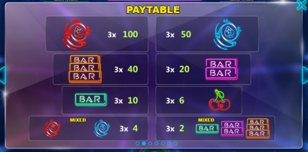

# Analysis of Diamond Stars game from Pokerstars


Diamond Stars is one of the most popular slots game on Pokerstars. In this notebook, I'll analyse the payout table and attempt to recreate the reel details of Diamond Stars. The RTP as stated is 91.97% plus 1.16% for jackpot.

## Payout tables in Game




Let's start with 3 reels. I put a 2x and 3x wild on the first reel, a 4x wild on the second reel, and a 5x reel on the third reel. Then I fill the remaining symbols table with estimation. There are 100 symbols on each reel, which is a common setup.


```python
# define the reels using a list of 3 dictionaries, each dictionary representing a reel
reels = [
    {
        'wild-5': 0,
        'wild-4': 0,
        'wild-3': 1,
        'wild-2': 1,
        'logo-red': 3,
        'logo-blue': 5,
        'bar-3': 8,
        'bar-2': 16,
        'bar-1': 24,
        'cherry': 42
    },
    {
        'wild-5': 0,
        'wild-4': 1,
        'wild-3': 0,
        'wild-2': 0,
        'logo-red': 3,
        'logo-blue': 5,
        'bar-3': 8,
        'bar-2': 16,
        'bar-1': 24,
        'cherry': 43
    },
    {
        'wild-5': 1,
        'wild-4': 0,
        'wild-3': 0,
        'wild-2': 0,
        'logo-red': 3,
        'logo-blue': 5,
        'bar-3': 8,
        'bar-2': 16,
        'bar-1': 24,
        'cherry': 43
    }
]
```


```python
# assert every reel has exactly 100 possible outcomes
for reel in reels:
    assert sum(reel[logo] for logo in reel) == 100
```

We will make a few helper functions to help us to calculate the payouts. The first helper function calculates the amount of payout with all three symbols being wilds on each payline. The event of hitting a wild on each reel is an independent event and we could take advantage of this.


```python
# helper function to calculate adjusted payout for three wilds
def calculate_payout_three_wilds(wild_payout=300):
    current_multiplier = 1
    # each reel can be considered independently
    for reel in reels:
        # add the sum of products of each wild multiplier by its frequencies
        current_multiplier *= sum(i * reel[f'wild-{i}'] for i in (2, 3, 4, 5))
    return current_multiplier * wild_payout
```


```python
calculate_payout_three_wilds()
```


    30000


Then we would write the payout function for each symbol. A payline including either the desirable symbol or the wild symbols would work, but at least one symbol on the payline should not be wild. A single function would do the job, we just need to call the function with different symbols and payouts as parameters.


```python
# helper function to calculate adjusted payout for a particular symbol, including possible wilds
def calculate_payout_by_symbol_or_wild(symbol, symbol_payout):
    hits = (symbol, 'wild-2', 'wild-3', 'wild-4', 'wild-5')
    payout_multiplier_sum = 0
    for reel0_symbol in hits:
        for reel1_symbol in hits:
            for reel2_symbol in hits:
                # must not be all wilds
                if symbol not in (reel0_symbol, reel1_symbol, reel2_symbol):
                    continue
                    
                current_multiplier = 1
                if reel0_symbol[:4] == 'wild':
                    current_multiplier *= int(reel0_symbol[5])
                if reel1_symbol[:4] == 'wild':
                    current_multiplier *= int(reel1_symbol[5])
                if reel2_symbol[:4] == 'wild':
                    current_multiplier *= int(reel2_symbol[5])

                # calculate the number of possibilites of hitting this particular combination
                num_possibilities = reels[0][reel0_symbol] * reels[1][reel1_symbol] * reels[2][reel2_symbol]
                payout_multiplier_sum += num_possibilities * current_multiplier
                
                # print combination for checking
#                 if num_possibilities > 0:
#                     print(reel0_symbol, reel1_symbol, reel2_symbol)
#                     print(f"{num_possibilities=} {current_multiplier=}")
    
    return payout_multiplier_sum * symbol_payout
                   

```


```python
print(f"{calculate_payout_by_symbol_or_wild('logo-red', 100)=}")
print(f"{calculate_payout_by_symbol_or_wild('logo-blue', 50)=}")
print(f"{calculate_payout_by_symbol_or_wild('bar-3', 40)=}")
print(f"{calculate_payout_by_symbol_or_wild('bar-2', 20)=}")
print(f"{calculate_payout_by_symbol_or_wild('bar-1', 10)=}")
print(f"{calculate_payout_by_symbol_or_wild('cherry', 6)=}")
```

    calculate_payout_by_symbol_or_wild('logo-red', 100)=34800
    calculate_payout_by_symbol_or_wild('logo-blue', 50)=40000
    calculate_payout_by_symbol_or_wild('bar-3', 40)=77120
    calculate_payout_by_symbol_or_wild('bar-2', 20)=174400
    calculate_payout_by_symbol_or_wild('bar-1', 10)=234480
    calculate_payout_by_symbol_or_wild('cherry', 6)=635592
    

Next it comes the mixed logo, and mixed bar. A payline should include at least two different logos or two bars to qualify for the awards. This can be implemented by modifying the previous payout functions.


```python
# helper function to calculate adjusted payout for a particular symbol, including possible wilds
def calculate_payout_mixed_logo_or_wild(mixed_logo_payout=4):
    hits = ('logo-red', 'logo-blue', 'wild-2', 'wild-3', 'wild-4', 'wild-5')
    payout_multiplier_sum = 0
    for reel0_symbol in hits:
        for reel1_symbol in hits:
            for reel2_symbol in hits:
                # at least two different logos are present
                if 'logo-red' not in (reel0_symbol, reel1_symbol, reel2_symbol) or \
                        'logo-blue' not in (reel0_symbol, reel1_symbol, reel2_symbol):
                    continue
                    
                current_multiplier = 1
                if reel0_symbol[:4] == 'wild':
                    current_multiplier *= int(reel0_symbol[5])
                if reel1_symbol[:4] == 'wild':
                    current_multiplier *= int(reel1_symbol[5])
                if reel2_symbol[:4] == 'wild':
                    current_multiplier *= int(reel2_symbol[5])

                # calculate the number of possibilites of hitting this particular combination
                num_possibilities = reels[0][reel0_symbol] * reels[1][reel1_symbol] * reels[2][reel2_symbol]
                payout_multiplier_sum += num_possibilities * current_multiplier
                
                # print combination for checking
#                 if num_possibilities > 0:
#                     print(reel0_symbol, reel1_symbol, reel2_symbol)
#                     print(f"{num_possibilities=} {current_multiplier=}")
    
    return payout_multiplier_sum * mixed_logo_payout    
```


```python
calculate_payout_mixed_logo_or_wild()
```


    3120


```python
# helper function to calculate adjusted payout for a particular symbol, including possible wilds
def calculate_payout_mixed_bars_or_wild(mixed_bars_payout=2):
    hits = ('bar-1', 'bar-2', 'bar-3', 'wild-2', 'wild-3', 'wild-4', 'wild-5')
    payout_multiplier_sum = 0
    for reel0_symbol in hits:
        for reel1_symbol in hits:
            for reel2_symbol in hits:
                
                reel_symbols = [reel0_symbol, reel1_symbol, reel2_symbol]
                # at least two different bars are present
                if ('bar-1' in reel_symbols) + ('bar-2' in reel_symbols) + ('bar-3' in reel_symbols) < 2:
                    continue
                    
                current_multiplier = 1
                if reel0_symbol[:4] == 'wild':
                    current_multiplier *= int(reel0_symbol[5])
                if reel1_symbol[:4] == 'wild':
                    current_multiplier *= int(reel1_symbol[5])
                if reel2_symbol[:4] == 'wild':
                    current_multiplier *= int(reel2_symbol[5])

                # calculate the number of possibilites of hitting this particular combination
                num_possibilities = reels[0][reel0_symbol] * reels[1][reel1_symbol] * reels[2][reel2_symbol]
                payout_multiplier_sum += num_possibilities * current_multiplier
                
                # print combination for checking
                # if num_possibilities > 0:
                #     print(reel0_symbol, reel1_symbol, reel2_symbol)
                #     print(f"{num_possibilities=} {current_multiplier=}")
    
    return payout_multiplier_sum * mixed_bars_payout   
```


```python
calculate_payout_mixed_bars_or_wild()
```


    223744


Finally, let's calculate RTP (Return to Player). A slots game with RTP < 1 (100%) would be profitable to the game host.


```python
# helper function to calculate RTP
def calculate_RTP():
    # 3 reels of 100 possiblities each
    base_num_possibilities = 100 * 100 * 100
    
    return sum([
        calculate_payout_three_wilds(wild_payout=300),
        calculate_payout_by_symbol_or_wild('logo-red', 100),
        calculate_payout_by_symbol_or_wild('logo-blue', 50),
        calculate_payout_by_symbol_or_wild('bar-3', 40),
        calculate_payout_by_symbol_or_wild('bar-2', 20),
        calculate_payout_by_symbol_or_wild('bar-1', 10),
        calculate_payout_by_symbol_or_wild('cherry', 6),
        calculate_payout_mixed_logo_or_wild(mixed_logo_payout=4),
        calculate_payout_mixed_bars_or_wild(mixed_bars_payout=2)
    ]) / base_num_possibilities
```


```python
calculate_RTP()
```


    1.453256


And put everything together into a nice table.


```python
# helper function to create a table for showing all the data
def results_table():
    import tabulate
    data = [
        ["Payout Type", "Payout"],
        ["Three Wilds", calculate_payout_three_wilds(wild_payout=300)],
        ["Red Logo", calculate_payout_by_symbol_or_wild('logo-red', 100)],
        ["Blue Logo", calculate_payout_by_symbol_or_wild('logo-blue', 50)],
        ["Bar 3", calculate_payout_by_symbol_or_wild('bar-3', 40)],
        ["Bar 2", calculate_payout_by_symbol_or_wild('bar-2', 20)],
        ["Bar 1", calculate_payout_by_symbol_or_wild('bar-1', 10)],
        ["Cherry", calculate_payout_by_symbol_or_wild('cherry', 6)],
        ["Mixed Logos", calculate_payout_mixed_logo_or_wild(mixed_logo_payout=4)],
        ["Mixed Bars", calculate_payout_mixed_bars_or_wild(mixed_bars_payout=2)],
        ["", ""],
        ["RTP", calculate_RTP()]
    ]
    table = tabulate.tabulate(data, tablefmt='html')
    return table


```


```python
results_table()
```


<table>
<tbody>
<tr><td>Payout Type</td><td>Payout  </td></tr>
<tr><td>Three Wilds</td><td>30000   </td></tr>
<tr><td>Red Logo   </td><td>34800   </td></tr>
<tr><td>Blue Logo  </td><td>40000   </td></tr>
<tr><td>Bar 3      </td><td>77120   </td></tr>
<tr><td>Bar 2      </td><td>174400  </td></tr>
<tr><td>Bar 1      </td><td>234480  </td></tr>
<tr><td>Cherry     </td><td>635592  </td></tr>
<tr><td>Mixed Logos</td><td>3120    </td></tr>
<tr><td>Mixed Bars </td><td>223744  </td></tr>
<tr><td>           </td><td>        </td></tr>
<tr><td>RTP        </td><td>1.453256</td></tr>
</tbody>
</table>


Current the RTP is 145.33%, which is too high. We can see from the table that a large amount of payout comes from cherries. Red Logo, Blue Logo and Bar 3, despite being high value, is only contributing a small amount of payout. Let's revise the reels table to decrease the number of cherries and increase the number of other logos.

Here is a new symbols table for a possible setup of reels. The number of cherries are decreased significantly while the number of other symbols are increased a bit.


```python
reels = [
    {
        'wild-5': 0,
        'wild-4': 0,
        'wild-3': 1,
        'wild-2': 1,
        'logo-red': 8,
        'logo-blue': 13,
        'bar-3': 12,
        'bar-2': 16,
        'bar-1': 22,
        'cherry': 27
    },
    {
        'wild-5': 0,
        'wild-4': 1,
        'wild-3': 0,
        'wild-2': 0,
        'logo-red': 8,
        'logo-blue': 13,
        'bar-3': 12,
        'bar-2': 16,
        'bar-1': 22,
        'cherry': 28
    },
    {
        'wild-5': 1,
        'wild-4': 0,
        'wild-3': 0,
        'wild-2': 0,
        'logo-red': 8,
        'logo-blue': 13,
        'bar-3': 12,
        'bar-2': 16,
        'bar-1': 22,
        'cherry': 28
    }
]

# assert every reel has exactly 100 possible outcomes
for reel in reels:
    assert sum(reel[logo] for logo in reel) == 100
```

Let's display the information of the reels in a table as well.


```python
# helper function to create a table for showing the number of symbols on each reel
def reels_table():
    import tabulate
    data = [
        ["Reel #", 0, 1, 2],
        ["5x Whild", reels[0]['wild-5'], reels[1]['wild-5'], reels[2]['wild-5']],
        ["4x Whild", reels[0]['wild-4'], reels[1]['wild-4'], reels[2]['wild-4']],
        ["3x Whild", reels[0]['wild-3'], reels[1]['wild-3'], reels[2]['wild-3']],
        ["2x Whild", reels[0]['wild-2'], reels[1]['wild-2'], reels[2]['wild-2']],
        ["Red Logo", reels[0]['logo-red'], reels[1]['logo-red'], reels[2]['logo-red']],
        ["Blue Logo", reels[0]['logo-blue'], reels[1]['logo-blue'], reels[2]['logo-blue']],
        ["Bar 3", reels[0]['bar-3'], reels[1]['bar-3'], reels[2]['bar-3']],
        ["Bar 2", reels[0]['bar-2'], reels[1]['bar-2'], reels[2]['bar-2']],
        ["Bar 1", reels[0]['bar-1'], reels[1]['bar-1'], reels[2]['bar-1']],
        ["Cherry",  reels[0]['cherry'], reels[1]['cherry'], reels[2]['cherry']],
        ["Total", 100, 100, 100]
    ]
    table = tabulate.tabulate(data, tablefmt='html')
    return table
```


```python
reels_table()
```


<table>
<tbody>
<tr><td>Reel #   </td><td style="text-align: right;">  0</td><td style="text-align: right;">  1</td><td style="text-align: right;">  2</td></tr>
<tr><td>5x Whild </td><td style="text-align: right;">  0</td><td style="text-align: right;">  0</td><td style="text-align: right;">  1</td></tr>
<tr><td>4x Whild </td><td style="text-align: right;">  0</td><td style="text-align: right;">  1</td><td style="text-align: right;">  0</td></tr>
<tr><td>3x Whild </td><td style="text-align: right;">  1</td><td style="text-align: right;">  0</td><td style="text-align: right;">  0</td></tr>
<tr><td>2x Whild </td><td style="text-align: right;">  1</td><td style="text-align: right;">  0</td><td style="text-align: right;">  0</td></tr>
<tr><td>Red Logo </td><td style="text-align: right;">  8</td><td style="text-align: right;">  8</td><td style="text-align: right;">  8</td></tr>
<tr><td>Blue Logo</td><td style="text-align: right;"> 13</td><td style="text-align: right;"> 13</td><td style="text-align: right;"> 13</td></tr>
<tr><td>Bar 3    </td><td style="text-align: right;"> 12</td><td style="text-align: right;"> 12</td><td style="text-align: right;"> 12</td></tr>
<tr><td>Bar 2    </td><td style="text-align: right;"> 16</td><td style="text-align: right;"> 16</td><td style="text-align: right;"> 16</td></tr>
<tr><td>Bar 1    </td><td style="text-align: right;"> 22</td><td style="text-align: right;"> 22</td><td style="text-align: right;"> 22</td></tr>
<tr><td>Cherry   </td><td style="text-align: right;"> 27</td><td style="text-align: right;"> 28</td><td style="text-align: right;"> 28</td></tr>
<tr><td>Total    </td><td style="text-align: right;">100</td><td style="text-align: right;">100</td><td style="text-align: right;">100</td></tr>
</tbody>
</table>


And calculate the RTP table again.


```python
results_table()
```


<table>
<tbody>
<tr><td>Payout Type</td><td>Payout  </td></tr>
<tr><td>Three Wilds</td><td>30000   </td></tr>
<tr><td>Red Logo   </td><td>192800  </td></tr>
<tr><td>Blue Logo  </td><td>270400  </td></tr>
<tr><td>Bar 3      </td><td>180960  </td></tr>
<tr><td>Bar 2      </td><td>174400  </td></tr>
<tr><td>Bar 1      </td><td>188540  </td></tr>
<tr><td>Cherry     </td><td>202152  </td></tr>
<tr><td>Mixed Logos</td><td>37856   </td></tr>
<tr><td>Mixed Bars </td><td>262304  </td></tr>
<tr><td>           </td><td>        </td></tr>
<tr><td>RTP        </td><td>1.539412</td></tr>
</tbody>
</table>


This time it is even worse. Maybe a roughly equal chance of hitting a symbol on each reel is not a good idea.

Let's try something different. What if the symbols of each kind are more concentrated in one or two reels?


```python
reels = [
    {
        'wild-5': 0,
        'wild-4': 0,
        'wild-3': 1,
        'wild-2': 1,
        'logo-red': 3,
        'logo-blue': 23,
        'bar-3': 5,
        'bar-2': 5,
        'bar-1': 52,
        'cherry': 10
    },
    {
        'wild-5': 0,
        'wild-4': 1,
        'wild-3': 0,
        'wild-2': 0,
        'logo-red': 4,
        'logo-blue': 5,
        'bar-3': 5,
        'bar-2': 31,
        'bar-1': 6,
        'cherry': 48
    },
    {
        'wild-5': 1,
        'wild-4': 0,
        'wild-3': 0,
        'wild-2': 0,
        'logo-red': 17,
        'logo-blue': 5,
        'bar-3': 16,
        'bar-2': 5,
        'bar-1': 6,
        'cherry': 50
    }
]

# assert every reel has exactly 100 possible outcomes
for reel in reels:
    assert sum(reel[logo] for logo in reel) == 100
```


```python
reels_table()
```


<table>
<tbody>
<tr><td>Reel #   </td><td style="text-align: right;">  0</td><td style="text-align: right;">  1</td><td style="text-align: right;">  2</td></tr>
<tr><td>5x Whild </td><td style="text-align: right;">  0</td><td style="text-align: right;">  0</td><td style="text-align: right;">  1</td></tr>
<tr><td>4x Whild </td><td style="text-align: right;">  0</td><td style="text-align: right;">  1</td><td style="text-align: right;">  0</td></tr>
<tr><td>3x Whild </td><td style="text-align: right;">  1</td><td style="text-align: right;">  0</td><td style="text-align: right;">  0</td></tr>
<tr><td>2x Whild </td><td style="text-align: right;">  1</td><td style="text-align: right;">  0</td><td style="text-align: right;">  0</td></tr>
<tr><td>Red Logo </td><td style="text-align: right;">  3</td><td style="text-align: right;">  4</td><td style="text-align: right;"> 17</td></tr>
<tr><td>Blue Logo</td><td style="text-align: right;"> 23</td><td style="text-align: right;">  5</td><td style="text-align: right;">  5</td></tr>
<tr><td>Bar 3    </td><td style="text-align: right;">  5</td><td style="text-align: right;">  5</td><td style="text-align: right;"> 16</td></tr>
<tr><td>Bar 2    </td><td style="text-align: right;">  5</td><td style="text-align: right;"> 31</td><td style="text-align: right;">  5</td></tr>
<tr><td>Bar 1    </td><td style="text-align: right;"> 52</td><td style="text-align: right;">  6</td><td style="text-align: right;">  6</td></tr>
<tr><td>Cherry   </td><td style="text-align: right;"> 10</td><td style="text-align: right;"> 48</td><td style="text-align: right;"> 50</td></tr>
<tr><td>Total    </td><td style="text-align: right;">100</td><td style="text-align: right;">100</td><td style="text-align: right;">100</td></tr>
</tbody>
</table>


```python
results_table()
```


<table>
<tbody>
<tr><td>Payout Type</td><td>Payout </td></tr>
<tr><td>Three Wilds</td><td>30000  </td></tr>
<tr><td>Red Logo   </td><td>130800 </td></tr>
<tr><td>Blue Logo  </td><td>121000 </td></tr>
<tr><td>Bar 3      </td><td>71600  </td></tr>
<tr><td>Bar 2      </td><td>68000  </td></tr>
<tr><td>Bar 1      </td><td>61700  </td></tr>
<tr><td>Cherry     </td><td>256800 </td></tr>
<tr><td>Mixed Logos</td><td>28212  </td></tr>
<tr><td>Mixed Bars </td><td>174328 </td></tr>
<tr><td>           </td><td>       </td></tr>
<tr><td>RTP        </td><td>0.94244</td></tr>
</tbody>
</table>


After a lot of tweaking and fine-tuning, I brought the RTP to 94.24%. This is much harder than I expected it to be. But this is an eye-opening exercise. Changing a symbol on the reel to another decreases the payout of one type of combo, but increases the payout of another. It is interesting to play around the reels table while trying to make the overall payout to stay within the budget.

Anyway, here is my first analysis of a slots game. For further improvements, I should probably write a couple of helper functions that tells me the effect of adding or removing a symbol on the payout budget. This would save a lot of time for tweaking the numbers to find the right amount of symbols on each reel.
